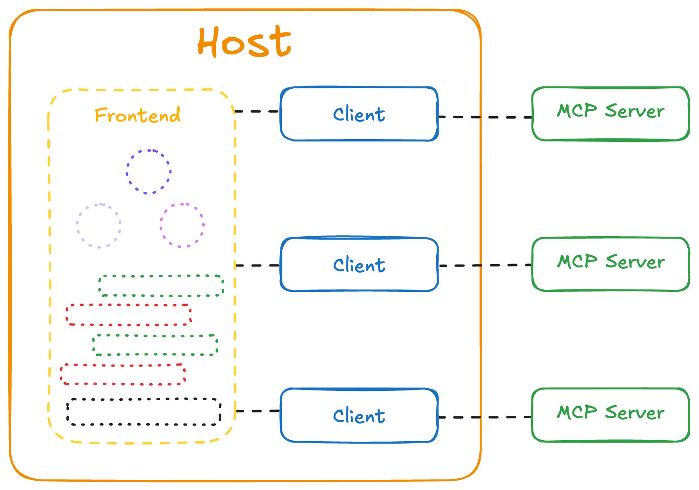
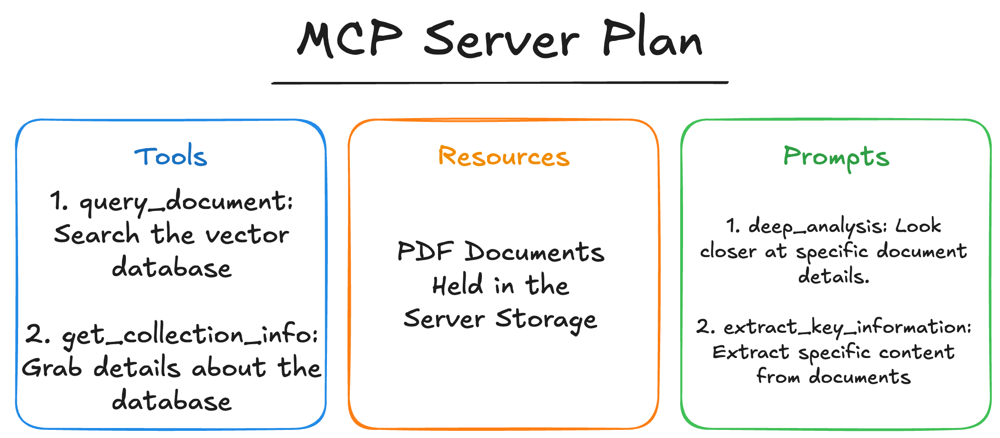

# Standardizing LLM Interaction with MCP Servers

Model Context Protocol, or MCP, is [an open protocol that standardizes how applications provide context to LLMs](https://modelcontextprotocol.io/introduction). In other words it provides a unified framework for LLM based applications to connect to connect to data sources, get context, use tools, and execute standard prompts.



The MCP ecosystem outlines three specific components:

- **MCP Servers** handle: tool availability (exposing what functions are available), tool execution (running those functions when requested), static content as resources (providing data that can be referenced), preset prompts (standardized templates for common tasks)

- **Clients** manage: Connections to servers, LLM integration, message passing between components

- **Hosts** provide: Frontend interfaces, surfacing of MCP functionality to users, integration points for the overall ecosystem

This architecture creates a modular system where different components can be developed independently while maintaining interoperability. This let's users make MCP servers for different LLM related functionalities then plug and play across a variety of supported applications. Commonly used to integrate services APIs and tools, or connect to local datasources on your own machine.

## MCP Server Components

MCP servers form the foundation of the protocol by exposing standardized capabilities through well-defined interfaces. Hosts and clients can then connect to these servers using the protocol standard, but how these capabilities are presented to users remains flexible and open to developers. That means that the actual implementation and user experience is entirely up to the developer - whether through command line interfaces, graphical applications, or embedded within larger systems.

In this guide, we'll focus on building an example MCP server with core capabilities, along with a simple client implementation to demonstrate the interaction patterns. To start, let's go over the main components of an MCP Server:


### Tools

Tools are functions that the LLM can invoke to perform actions or retrieve information. Each tool is defined with:

```python
{
  name: string;          // Unique identifier for the tool
  description?: string;  // Human-readable description
  inputSchema: {         // JSON Schema for the tool's parameters
    type: "object",
    properties: { ... }  // Tool-specific parameters
  }
}
```

Tools allow LLMs to interact with external systems, execute code, query databases, or perform calculations. They represent actions that have effects or compute new information.

### Resources

Resources represent data sources that can be accessed by the client application. They are identified by URIs and can include:

```python
{
  uri: string;           // Unique identifier for the resource
  name: string;          // Human-readable name
  description?: string;  // Optional description
  mimeType?: string;     // Optional MIME type
}
```

Resources can be static (like configuration files) or dynamic (like database records or API responses). They provide context to the LLM without requiring function calls.

### Prompts

Prompts are reusable templates that define specific interaction patterns. They allow servers to expose standardized conversation flows:

```python
{
  name: string;              // Unique identifier for the prompt
  description?: string;      // Human-readable description
  arguments?: [              // Optional list of arguments
    {
      name: string;          // Argument identifier
      description?: string;  // Argument description
      required?: boolean;    // Whether argument is required
    }
  ]
}
```

Prompts help create consistent, purpose-built interactions for common tasks, allowing users to invoke them through UI elements like slash commands.

*Note: While tools are designed specifically for LLM interaction (similar to function calling), prompts and resources serve different purposes in the MCP ecosystem. Prompts are typically user-controlled templates that can be invoked directly through UI elements like slash commands, and resources are application-controlled data sources that may be presented to users for selection before being included in the LLM context.*

More details and additional functionality can be found in the [MCP Official Documentation](https://modelcontextprotocol.io/introduction)

---
# Setting Up Our Example

Our MCP Server will highlight tools, resources, and prompts. The core concept is to create a simple knowledgebase chatbot flow that will be have the functionality to:
1. Let the LLM use tools to query a vector database for RAG responses
2. Let the user choose existing resources to provide context
3. Let the user execute standard prompts for more complex analytical workflows



The above diagram is what's implemented in [mcp_server.py](./mcp_server.py) with a corresponding simple CLI client in [client.py](./client.py).

As a useful resource, check out [MCP's Server List](https://github.com/modelcontextprotocol/servers) for official integrations and community-made servers.

---
# Setup and Installation

1. Clone the Repo
```
git clone https://github.com/ALucek/quick-mcp-example.git
cd quick-mcp-example
```

2. Create the ChromaDB Database

Follow the instructions in [MCP_setup.ipynb](./MCP_setup.ipynb) to create the vector database and embed a pdf into it.

3. Create the Virtual Environment and Install Packages
```
# Using uv (recommended)
uv venv
source .venv/bin/activate  # On macOS/Linux
# OR
.venv\Scripts\activate     # On Windows

# Install dependencies
uv sync
```

4. Run the Client & Server

```
python client.py mcp_server.py
```
